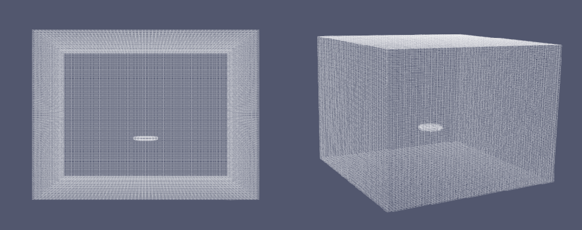
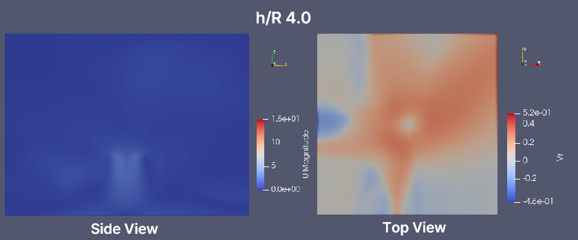
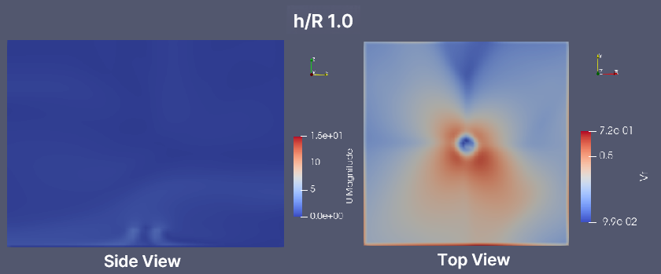
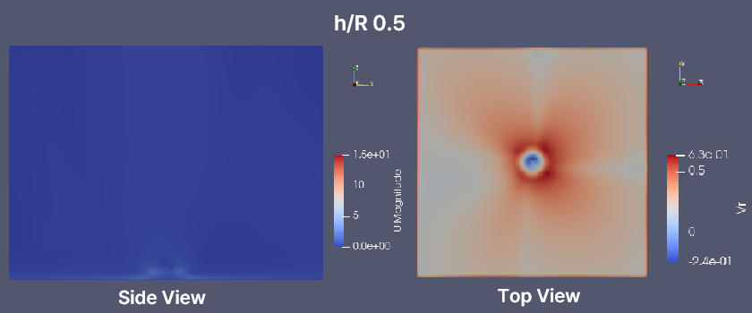

# Track B: OpenFOAM v13 기반 Propeller Disk IGE 정량화

이 프로젝트는 OpenFOAM Foundation v13의 `propellerDisk` fvModel과 `createZones` 기반 mesh-zone workflow를 이용해 hover in-ground-effect(IGE) 조건을 모델링하고, 프로펠러 높이 `h/R` 변화에 따른 성능비와 near-ground outwash peak 위치를 정량적으로 비교한 작업이다.

본 프로젝트의 목적은 특정 상용 프로펠러의 절대 성능을 정밀하게 맞추는 것이 아니라, 지면 높이 변화에 따른 상대 경향과 모델 민감도를 일관된 기준으로 정리하는 데 있다.

---

## 프로젝트 질문

- 지면 높이 `h/R`가 감소하면 성능비 `T/Tref`, `P/Pref`는 어떻게 변하는가?
- near-ground outwash peak 위치 `rmax/R`는 어떻게 이동하는가?
- 저고도 구간의 결과는 low-`J` curve 가정에 얼마나 민감한가?

---

## 핵심 결과

- `h/R`가 감소할수록 near-ground outwash peak 위치 `rmax/R`는 바깥쪽에서 안쪽으로 이동하는 경향을 보였다.
- 현재 모델 설정에서는 `T/Tref`, `P/Pref`가 `h/R <= 1` 구간에서 포화형 거동을 보였다.
- `rmax/R`는 `h/R = 0.5`와 `0.35`에서 동일한 추출값을 보여, 현재 후처리 체계에서는 저고도 포화형 경향을 시사했다.
- 다만 Day8 민감도 결과상 `h/R = 0.5` 부근은 low-`J` curve 가정의 영향이 커서, 저고도 plateau 해석은 조건부로 읽어야 한다.

---

## 최종 정량 결과

최종 결과 파일:
- [day10_final_table.csv](cases/sweep_baselineHover/day10_final_table.csv)
- [day10_qc_report.txt](cases/sweep_baselineHover/day10_qc_report.txt)

| case | h/R | T/Tref | P/Pref | rmax/R | Vr,peak [m/s] |
|---|---:|---:|---:|---:|---:|
| hR4 | 4.00 | 1.00000000 | 1.00000000 | 1.9327585352 | 0.2733748424 |
| hR2 | 2.00 | 1.06613377 | 1.04373033 | 1.6499158228 | 0.4207111644 |
| hR1 | 1.00 | 1.08174701 | 1.05391000 | 1.3670731103 | 0.5231999901 |
| hR0p5 | 0.50 | 1.08174701 | 1.05391000 | 1.2727922061 | 0.5542382631 |
| hR0p35 | 0.35 | 1.08174701 | 1.05391000 | 1.2727922061 | 0.5491452153 |

---

## `rmax/R`의 정의

`rmax/R`는 near-ground plane(`z = 0.01 m`)에서 추출한 radial outwash profile `Vr(r)`의 최대 위치를 프로펠러 반지름 `R`로 정규화한 값이다.

- `r = sqrt(x^2 + y^2)`
- `Vr = U · er`
- 같은 반경에 있는 점들을 annulus 평균하여 `Vr(r)`를 만든 뒤,
- 그 최대 위치 `rmax`를 찾아 `rmax/R`로 정리했다.

즉, `rmax/R`는 지면 가까운 평면에서 바깥으로 퍼지는 유동이 가장 강한 위치가 프로펠러 축에서 얼마나 떨어져 있는지를 나타내는 비교 지표다.

이 값은 절대 유동장 전체를 완전 검증한 지표가 아니라, 케이스 간 outwash peak 위치 변화를 일관된 기준으로 비교하기 위한 대표 지표다.

---

## 해석과 주의점

- 현재 모델 설정에서 `h/R`가 감소하면 `rmax/R`는 안쪽으로 이동한다.
- 같은 설정에서 `T/Tref`, `P/Pref`는 `h/R <= 1`에서 포화형 거동을 보인다.
- `h/R = 0.5`와 `0.35`에서 동일한 `rmax/R`가 추출된 것은 현재 annulus-averaged near-ground extraction 기준에서의 결과이며, 단일 평면/단일 peak-detection resolution에 의존하는 비교 지표다.
- 따라서 저고도 plateau는 현재 모델과 후처리 체계에서 관찰된 경향으로 해석해야 하며, 확정적인 물리 결론으로 직접 연결하면 안 된다.
- README의 시각화 이미지는 Day9/Day10의 정량 결과를 정성적으로 보조하기 위한 자료이며, 이미지 자체만으로 독립적인 물리 결론을 주장하지 않는다.

---

## 민감도 분석 (Day8)

참조 파일:
- [day8_compare_A_vs_B.csv](cases/sweep_sensitivity_lowJtilt/day8_compare_A_vs_B.csv)
- [day8_uncertainty_band.csv](cases/sweep_sensitivity_lowJtilt/day8_uncertainty_band.csv)

목적:
- 저고도 포화형 거동이 강건한 경향인지, 아니면 low-`J` propeller-curve extension 가정에 크게 좌우되는지 확인

대표 결과:

| h/R | delta T [%] | delta P [%] | uncertainty band T [±%] | uncertainty band P [±%] |
|---|---:|---:|---:|---:|
| 1.0 | -2.984 | -1.997 | 1.492 | 0.998 |
| 0.5 | +8.000 | +7.999 | 4.000 | 3.999 |

해석:
- `h/R = 0.5` 부근에서는 low-`J` curve 가정에 대한 민감도가 크다.
- 따라서 저고도 plateau 해석은 확정적 결론이 아니라 조건부 해석으로 두는 것이 적절하다.

---

## 해석 설정

- Solver: `foamRun` + `incompressibleFluid`
- 해석 형태: 비압축성 정상상태 RANS
- 난류모델: `kOmegaSST`
- 프로펠러 모델: `propellerDisk` actuator-disk
- 주요 스윕: `h/R = [4, 2, 1, 0.5, 0.35]`
- 주요 출력 지표:
  - 추력비 `T/Tref`
  - 동력비 `P/Pref`
  - outwash peak 위치 `rmax/R`
- 운동점성계수: `nu = 1.5e-05 m^2/s`
- 회전수: `n = 6.0 1/s`
- 프로펠러 지름: `D = 0.50 m`
- 허브 지름: `D_hub = 0.10 m`
- 계산영역: `4 m x 4 m x 3 m`
- 격자: structured hex, `64 x 64 x 96` = `393,216` cells
- 대표 Reynolds 수:
  - `Re_D = (pi n D) D / nu ≈ 3.14e5`

자세한 설정/참조 메모:
- [docs/metrics.md](docs/metrics.md)
- [docs/plan.md](docs/plan.md)
- [docs/references.md](docs/references.md)

---

## 대표 시각화

### 계산영역과 격자 배치

아래 그림은 계산영역, 지면, 그리고 propeller disk의 상대 배치를 보여주는 geometry sanity figure이다.  
본 프로젝트는 structured hex mesh와 `propeller` cellZone 기반 actuator-disk setup을 사용했다.



### near-ground outwash와 `rmax/R` 시각화

아래 그림들은 각 케이스의 ParaView 편집 이미지다.  
사이드 뷰에서는 downwash/outwash의 전체 유동 방향을, 탑 뷰에서는 near-ground plane에서의 radial outwash 분포와 `rmax/R` 위치를 정성적으로 보여준다.

<table>
  <tr>
    <td align="center">
      <br>
      <sub><b>h/R = 4</b></sub>
    </td>
    <td align="center">
      <br>
      <sub><b>h/R = 1</b></sub>
    </td>
    <td align="center">
      <br>
      <sub><b>h/R = 0.5</b></sub>
    </td>
  </tr>
</table>

이 그림들은 Day9에서 정의한 `rmax/R` 추출 결과를 정성적으로 보조하는 자료다.  
정량값 자체는 `z = 0.01 m` 단일 near-ground plane에서 annulus-averaged radial outwash profile을 기반으로 계산된 값이며, 위 이미지는 그 결과를 시각적으로 이해하기 위한 설명 자료로 사용한다.

---

## 해석 범위와 한계

- 이 프로젝트의 목적은 특정 상용 프로펠러의 절대 성능을 정확히 예측하는 것이 아니다.
- `propellerDisk`는 reduced-order actuator-disk 모델이므로, blade-resolved CFD처럼 블레이드 하중 분포, tip vortex 구조, 상세 rotor-ground 상호작용을 직접 해석하지 않는다.
- 따라서 핵심 결과는 절대값 자체보다 지면 높이 변화에 따른 상대 지표 `T/Tref`, `P/Pref`, `rmax/R`의 경향으로 읽어야 한다.
- baseline hover에서 사용한 low-`J` 확장은 운전점 정의역을 맞추기 위한 모델 가정이다.
- Day8 결과상 저고도 구간, 특히 `h/R = 0.5` 부근은 이 가정에 민감하다.
- `rmax/R`는 `z = 0.01 m` 단일 near-ground plane에서 annulus 평균으로 추출한 후처리 지표다.
- 따라서 `rmax/R`는 전체 유동장을 완전 검증한 값이 아니라, 케이스 간 비교를 위한 대표 지표로 해석해야 한다.

---

## 분석 흐름

- mesh 및 `propeller` cellZone 구성
- baseline hover reference 확정
- `h/R` 스윕과 성능비 추출
- low-`J` curve 민감도 평가
- near-ground outwash 샘플링과 `rmax/R` 추출
- Day7/Day9 결과 통합 및 QC
- 발표/포트폴리오용 figure 제작

---

## 재현 파일

- Day5 baseline reference:
  - [ref_final_baselineHover.json](cases/baseCase_baselineHover/results/ref_final_baselineHover.json)
  - [ref_final_baselineHover.csv](cases/baseCase_baselineHover/results/ref_final_baselineHover.csv)
- Day8 sensitivity:
  - [day8_compare_A_vs_B.csv](cases/sweep_sensitivity_lowJtilt/day8_compare_A_vs_B.csv)
  - [day8_uncertainty_band.csv](cases/sweep_sensitivity_lowJtilt/day8_uncertainty_band.csv)
- Day9 outwash:
  - [day9_outwash_summary.csv](cases/sweep_baselineHover/day9_outwash_summary.csv)
- Day10 integration:
  - [day10_final_table.csv](cases/sweep_baselineHover/day10_final_table.csv)
  - [day10_qc_report.txt](cases/sweep_baselineHover/day10_qc_report.txt)

재현성 메모:
- Day10 이후 단계는 새로운 CFD 계산을 돌리지 않고, 기존 CSV와 로그를 후처리로 정리한 단계다.
- Day9는 현재 저장된 runner와 기능적으로 동등한 runner로 최종 산출물을 생성했다. 현재 runner는 임시 dict를 `results/` 아래에 쓰도록 안전 패치가 추가된 버전이다.

---

## 저장소 구조

```text
cases/
  baseCase_baselineHover/           # baseline reference case
  baseCase_sensitivity_originalCurve/
  sweep_baselineHover/              # main h/R sweep + final outputs
  sweep_sensitivity_lowJtilt/       # Day8 sensitivity outputs
docs/
  metrics.md
  plan.md
  references.md
  risk-log.md
scripts/
  run_day8_lowJ_sensitivity.sh
  day9_extract_outwash_rmax.py
  run_day9_outwash.sh
  day10_join_day7_day9.py
  run_day10_join.sh
figures/
  day12/                            # presentation figures
```

---

## 참고 문헌

- OpenFOAM v13 release notes: <https://openfoam.org/version/13/>
- OpenFOAM v13 propellerDisk API: <https://cpp.openfoam.org/v13/classFoam_1_1fv_1_1propellerDisk.html>
- OpenFOAM mesh zones guide: <https://doc.cfd.direct/openfoam/user-guide-v13/mesh-zones>
- NASA outwash IGE report: <https://ntrs.nasa.gov/api/citations/20160006428/downloads/20160006428.pdf>
- Cheeseman & Bennett (1955): <https://reports.aerade.cranfield.ac.uk/bitstream/handle/1826.2/3590/arc-rm-3021.pdf?isAllowed=y&sequence=1>
